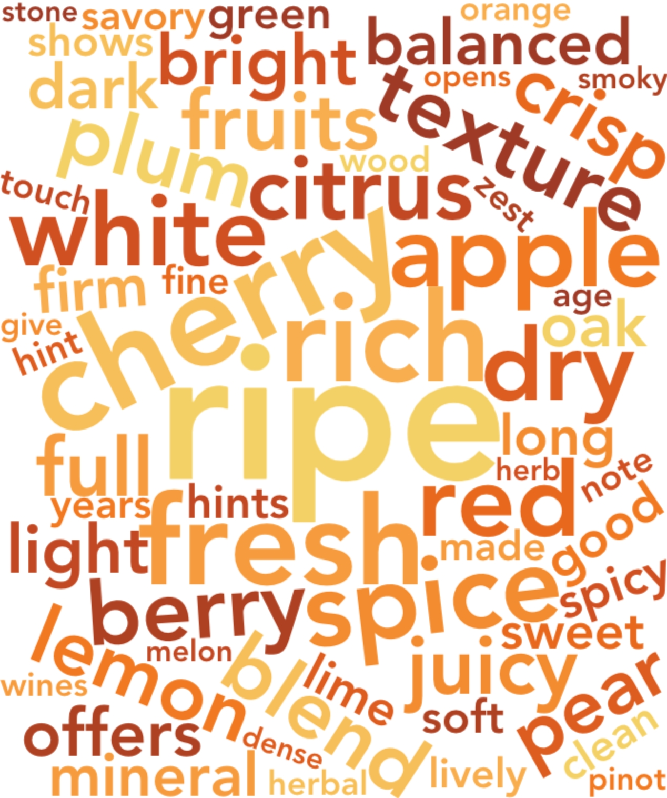
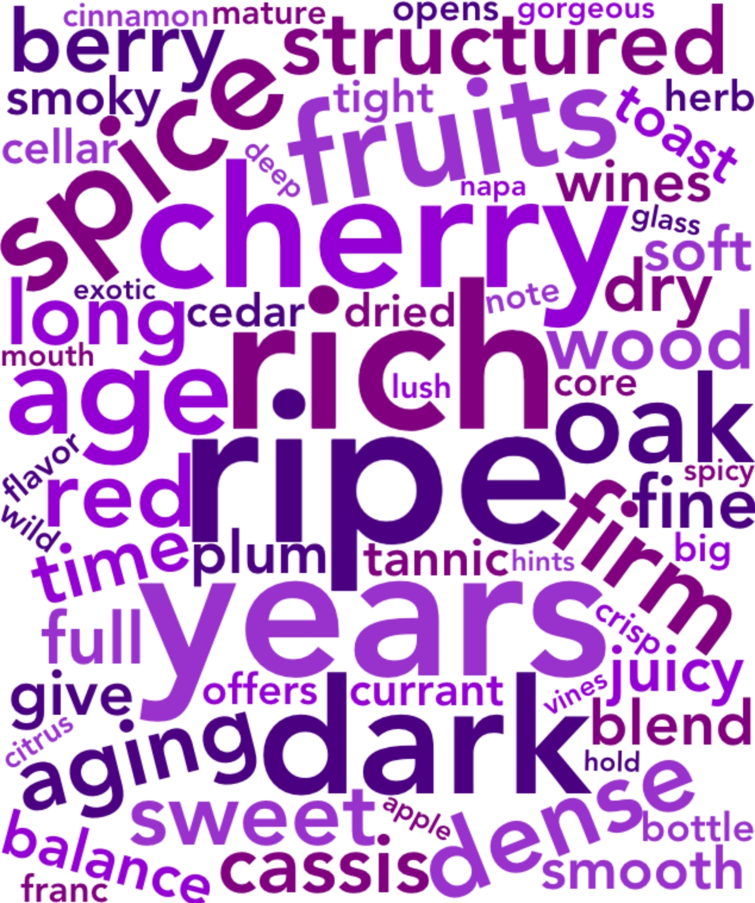

# FlavorCloud

This is a small R script I wrote for my final project for DGMD S-76 (Data Visualization and Communication with Data). This script helps distinguish between the flavor profiles of the top 25% scored wines worth more than \$100 against the top 25% scored wines worth \$25 or less. 

Using the [Wine Reviews](https://www.kaggle.com/zynicide/wine-reviews) kaggle dataset, I subsetted my data into two separate datasets:

1. `top_affordable` - Wines with a lowest score at the 75th percentile of all wines that are worth $25 or less
2. `top_expensive` - Wines with a lowest score at the 75th percentile of all wines that are worth $100 or more

I proceeded to use some standard NLP on the flavor descriptions of all the wines in each dataset to extract key words that define the flavor profile and created a frequency distribution of these key words. I chose to visualize the most dominant flavor components across highly rated affordable and expensive in the form of two separate word clouds. Larger words represent more frequent flavor components across the type of wine.

The final outcome came out to something like this:

Affordable Wines           |  Expensive Wines
:-------------------------:|:-------------------------:
    |  